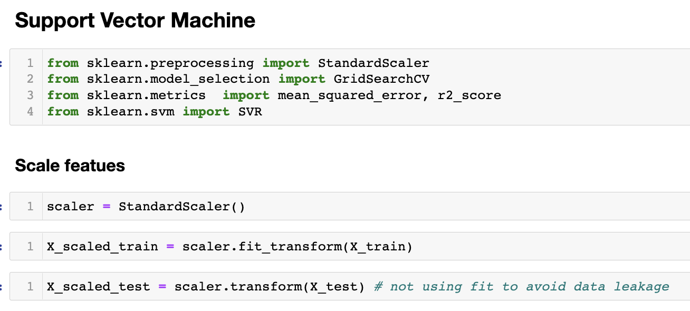

# REGRESSION: Bitcoin Price Predict

## Overview

* Predict Bitcoin **daily close price** before the end of traidng day. 
* **Data** from **KraKen API OHLC endpoint** combined with OHLC for historical data dated back to 2013. 
* **Machine Learning Model** used initially is **Support Vector Machine**. However, other ML models can be used to compare and improve accuracy.


---

## Data Source and Preparation

* **KraKen Historical OHLC**
* **KraKen API OHLC**

```
kraken_ohlc_cols = ["date","open", "high", "low", "close", "vwap","volume", "trades"]

resp = requests.get('https://api.kraken.com/0/public/OHLC?pair=XBTUSD&interval=1440&since=unix_now').json()

xbt_apr22_df = pd.DataFrame(resp["result"]['XXBTZUSD'])

xbt_apr22_df.columns = kraken_ohlc_cols
```
## Visualization


## Machine Learning Model | Support Vector Machine


```
param_grid = {'kernel': ['linear'], 'C': [100,300, 500], 'epsilon': [0.00001, 0.0001, 0.001]}
svr = SVR()
grid_search = GridSearchCV(svr, param_grid, cv=5, scoring='r2')
grid_search.fit(X_scaled_train, y_train)
print(grid_search.best_params_)
svr_best = grid_search.best_estimator_
pred_svr_adjusted = svr_best.predict(X_scaled_test)
print(np.sqrt(mean_squared_error(y_test, pred_svr_adjusted)))
print(r2_score(y_test, pred_svr_adjusted))

```


## Evaluation


Lorem ipsum dolor sit amet consectetur adipisicing elit. Excepturi, aliquid cum vitae, ipsa consequatur amet eum maiores sequi dolorum id minus dolore. Lorem ipsum dolor sit amet consectetur adipisicing elit. Excepturi, aliquid cum vitae, ipsa consequatur amet eum maiores sequi dolorum id minus dolore.


Lorem ipsum dolor sit amet consectetur adipisicing elit. Excepturi, aliquid cum vitae, ipsa consequatur amet eum maiores sequi dolorum id minus dolore. Lorem ipsum dolor sit amet consectetur adipisicing elit. Excepturi, aliquid cum vitae, ipsa consequatur amet eum maiores sequi dolorum id minus dolore.

## Possible Application/Business Problem

* Help inform retail investors/users possible close price, ruturn , trend of Bitcoin and other cryptocurrency
* The model can be developed to live prediction and with shorter timeframe, 4 hours, 1 hours as example
* The model can be improved, modified and used with other cryptocurrency or stocks

## Conclusions
