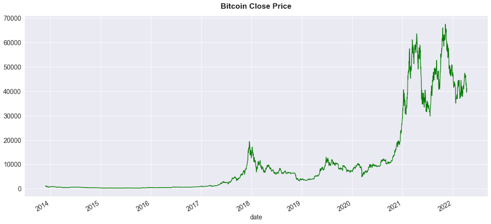
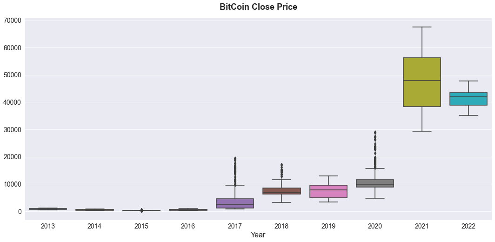
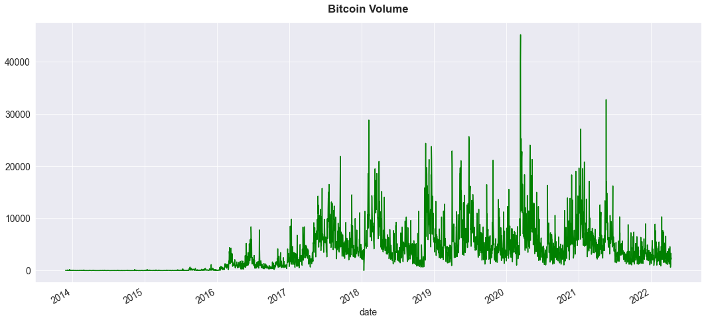
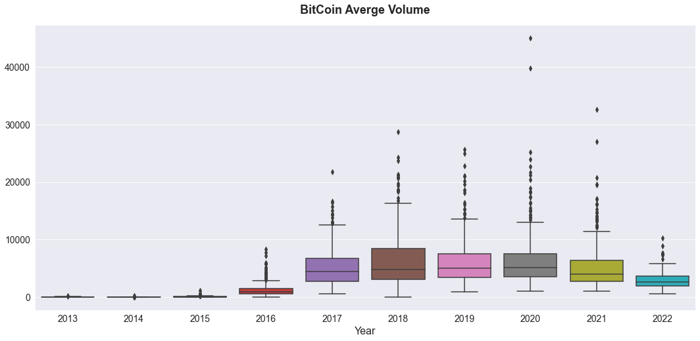
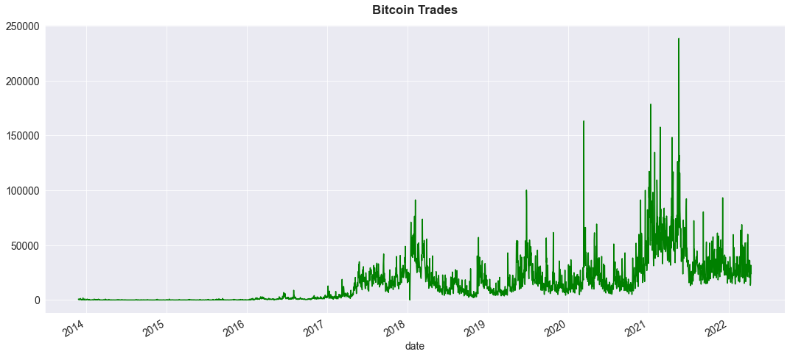
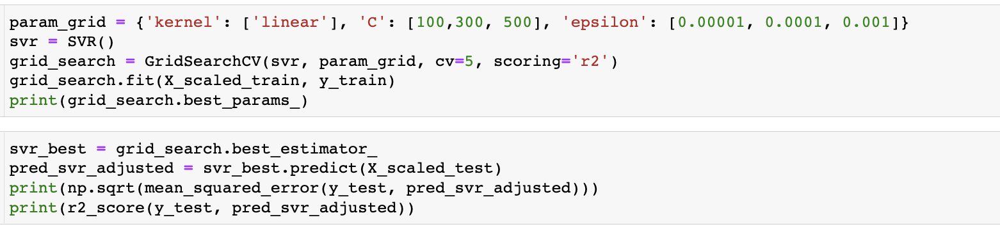
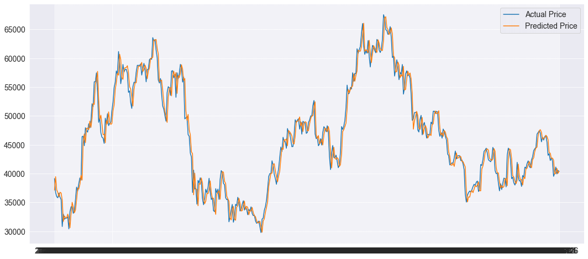
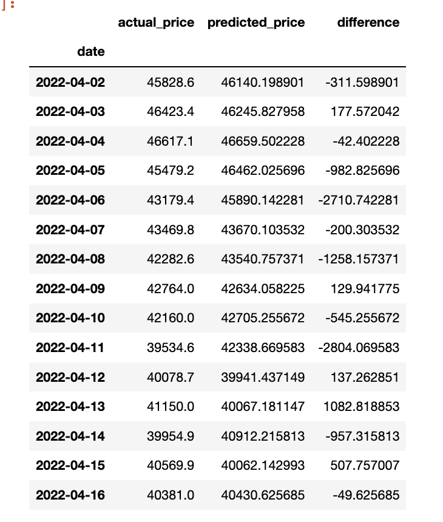

# REGRESSION: Bitcoin Price Predict

## Overview

* Predict Bitcoin **daily close price** before the end of trading day. 
* **Data** from **KraKen API OHLC endpoint** combined with OHLC for historical data dated back to 2013 — about 3,100 days
* **Machine Learning Model** used initially is **Support Vector Machine**. However, other ML models, such as Linear Regression, XGboost, Random Forest and neural networks can be used to compare and improve accuracy.




## Data Source and Preparation

* **KraKen Historical OHLC**
* **KraKen API OHLC**

```
kraken_ohlc_cols = ["date","open", "high", "low", "close", "vwap","volume", "trades"]

resp = requests.get('https://api.kraken.com/0/public/OHLC?pair=XBTUSD&interval=1440&since=unix_now').json()

xbt_apr22_df = pd.DataFrame(resp["result"]['XXBTZUSD'])

xbt_apr22_df.columns = kraken_ohlc_cols
```
## Visualization










## Support Vector Machine
```
from sklearn.preprocessing import StandardScaler
from sklearn.model_selection import GridSearchCV
from sklearn.metrics  import mean_squared_error, r2_score
from sklearn.svm import SVR
```
```
scaler = StandardScaler()
X_scaled_train = scaler.fit_transform(X_train)
X_scaled_test = scaler.transform(X_test) 
# not using fit to avoid data leakage 
```



## Result





## Possible Application

* Help inform retail investors/users possible close price, ruturn , trend of Bitcoin and other cryptocurrency
* The model can be developed to live prediction and with shorter timeframe, 4 hours, 1 hours as example
* The model can be improved, modified and used with other cryptocurrency or stocks

## Futher Improvement
* Using other machine learning models to compare and improve accuracy of the prediction, such as XGBoost, Random Forest, Deep Learning/LSTM etc.
* Adding more features such as Bid price, Ask price,VWAP, RSI, etc.
* Shorter timeframe such as 4 hours, 1 hours, 30 minutes etc.
