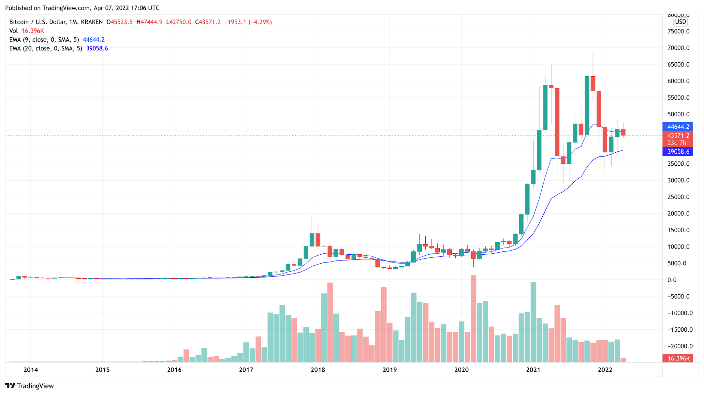

# REGRESSION: Bitcoin Price Predict

## Overview

Predict Bitcoin daily close price before the end of traidng day. Data from KraKen API OHLC endpoint combined with OHLC for historical data dated back to 2013. Machine Learning Model used initially is Support Vector Machine. However, other ML models can be used to compare and improve accuracy.

## Business Problem

Lorem ipsum dolor sit amet consectetur adipisicing elit. Excepturi, aliquid cum vitae, ipsa consequatur amet eum maiores sequi dolorum id minus dolore. Lorem ipsum dolor sit amet consectetur adipisicing elit. Excepturi, aliquid cum vitae, ipsa consequatur amet eum maiores sequi dolorum id minus dolore.

Questions to address:

Lorem ipsum dolor sit amet consectetur adipisicing elit. Excepturi, aliquid cum vitae, ipsa consequatur amet eum maiores sequi dolorum id minus dolore. Lorem ipsum dolor sit amet consectetur adipisicing elit. Excepturi, aliquid cum vitae, ipsa consequatur amet eum maiores sequi dolorum id minus dolore.

---

## Data Understanding and Preparation

### Visualizing the Data

## Data Modeling

## Evaluation

Lorem ipsum dolor sit amet consectetur adipisicing elit. Excepturi, aliquid cum vitae, ipsa consequatur amet eum maiores sequi dolorum id minus dolore. Lorem ipsum dolor sit amet consectetur adipisicing elit. Excepturi, aliquid cum vitae, ipsa consequatur amet eum maiores sequi dolorum id minus dolore.

### The Model Applicaition

Lorem ipsum dolor sit amet consectetur adipisicing elit. Excepturi, aliquid cum vitae, ipsa consequatur amet eum maiores sequi dolorum id minus dolore. Lorem ipsum dolor sit amet consectetur adipisicing elit. Excepturi, aliquid cum vitae, ipsa consequatur amet eum maiores sequi dolorum id minus dolore.

## Conclusions
