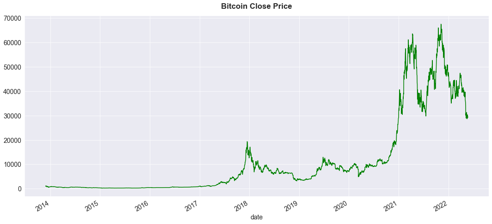

# REGRESSION: Bitcoin Price Predict

## Overview

The main goals of this project are:
* Getting data from API
* Creating my own dataset
* Finding information from the dataset
* Finding what machine learning model(s) could be used for the dataset
* Finding insights, possible actionable insights, and hopefully business application from the project


## Data Source and Preparation :astonished:

* **Kraken Crypto Currency Exchange**
* **API OHLC endpoint**
* CSV OHLC history data
* Data from 2013 to 2022

## Machine Learning Used
* **Support Vector Regresion**, as of July 2022
* **RMSE 1,291. Mean actual close price of $24,119, and Mean predicted close price of $24,655 for June 2022 prediction**


## Insights :fire:
* 2021 was the peek of Bitcoin
* 2022 Bitcoin started to drop
* Will it drop to $20,000? (2018's peek)
* **2022**
  * Jan-April: Bitcoin price ranges in $35,000-$47,000 Level
  * May: Bitcoin price dropped to $25,000-40,000 range
  * June-July?


## Possible Actionable Insights and Possible Business Application:fire:

* Help inform retail investors/users possible close price, possible return, trend of Bitcoin and other cryptocurrency
* The model can be improved, modified and used with other cryptocurrency or stocks

## Futher Improvement :dart:
* Using other machine learning models to compare and improve accuracy of the prediction, such as XGBoost, Random Forest, Deep Learning/LSTM etc.
* Adding more features such as Bid price, Ask price, VWAP, RSI, etc.
* Shorter timeframe such as 4 hours, 1 hours, 30 minutes etc.

___
## Visualization | [Tableau](https://public.tableau.com/app/profile/daranee8086/viz/shared/H9RSX9P3S)

### April 2022

### May 2022



```
kraken_ohlc_cols = ["date","open", "high", "low", "close", "vwap","volume", "trades"]

resp = requests.get('https://api.kraken.com/0/public/OHLC?pair=XBTUSD&interval=1440&since=unix_now').json()

xbt_apr22_df = pd.DataFrame(resp["result"]['XXBTZUSD'])

xbt_apr22_df.columns = kraken_ohlc_cols
```

### April 2022

### May 2022


### April 2022

### May 2022


### April 2022

### May 2022


### April 2022

### May 2022


### April 2022

### May 2022


### May 2022


## Support Vector Machine
```
from sklearn.preprocessing import StandardScaler
from sklearn.model_selection import GridSearchCV
from sklearn.metrics  import mean_squared_error, r2_score
from sklearn.svm import SVR
```
```
scaler = StandardScaler()
X_scaled_train = scaler.fit_transform(X_train)
X_scaled_test = scaler.transform(X_test) 
# not using fit to avoid data leakage 
```


## Result


